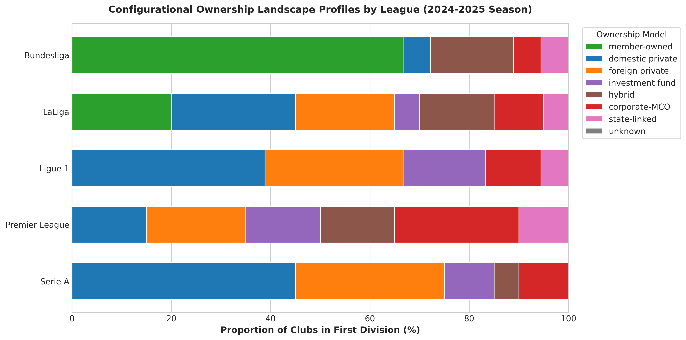
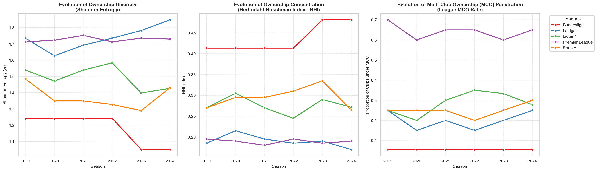
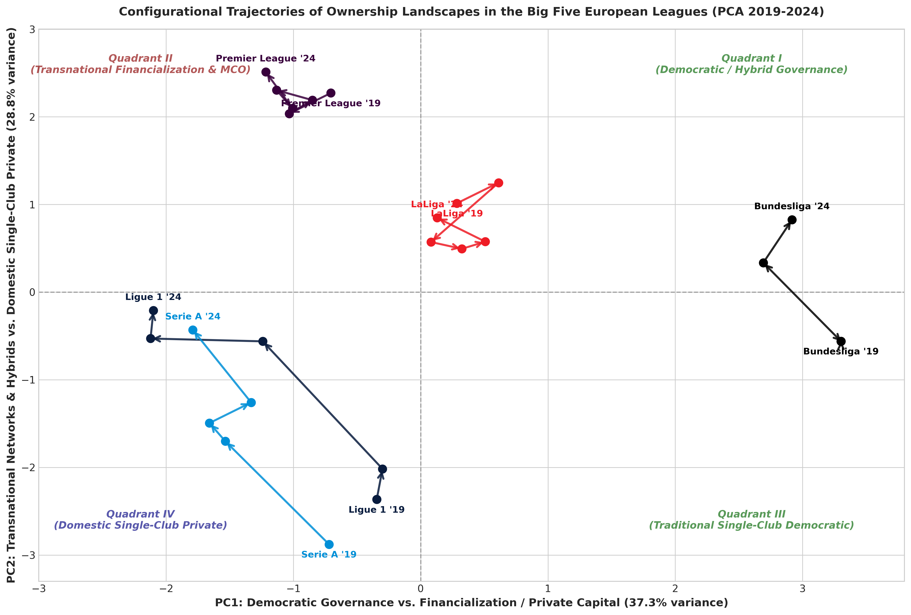

# Diseño Metodológico: Medición y Análisis del Ownership Landscape (2019–2024)

Este documento detalla la metodología cuantitativa empleada para la operacionalización, medición y análisis comparativo del constructo de **Ownership Landscape** (OL) en el fútbol de élite europeo. El enfoque se centra exclusivamente en la caracterización macro-configuracional de las ligas a través de indicadores de diversidad, concentración y la reducción dimensional del espacio de propiedad mediante Análisis de Componentes Principales (PCA).

---

## 1. Diseño de Investigación y Unidad de Análisis

El estudio adopta un **diseño cuantitativo, longitudinal, comparativo y exploratorio** con el propósito de ofrecer una primera aproximación empírica y reproducible al concepto de *Ownership Landscape*.

### Distinción Teórica y Nivel de Agregación

La premisa fundamental de este diseño es que el *Ownership Landscape* no es una propiedad individual de los clubes, sino una **propiedad emergente y colectiva del entorno competitivo** (la liga), en línea con la perspectiva de configuraciones organizacionales (Fiss, 2007). Por lo tanto:

* **Unidad de recopilación de datos**: El nivel de observación primario es el **club-temporada** (las características de propiedad y financieras de un club específico en un año determinado).
* **Unidad de análisis**: El nivel de agregación principal es la **liga-temporada** (la configuración conjunta que resulta de la distribución de modelos de propiedad dentro de una liga en un año determinado).

### Herramientas de Análisis y su Función Colectiva

Para capturar las distintas dimensiones de esta estructura colectiva, se emplean tres herramientas matemáticas complementarias:

1. **Entropía de Shannon ($H$)**: Mide el grado de **diversidad y equilibrio** del paisaje. Indica si coexisten múltiples lógicas de propiedad o si el sistema está dominado por pocas lógicas.
2. **Índice Herfindahl-Hirschman (HHI)**: Mide el grado de **concentración**. Permite evaluar la dominancia de modelos específicos y el nivel de homogeneidad del entorno.
3. **Análisis de Componentes Principales (PCA)**: Permite proyectar la **configuración conjunta** (las proporciones simultáneas de todos los modelos de propiedad) en un espacio de baja dimensión (2D) para clasificar las ligas, rastrear trayectorias temporales y visualizar la distancia configuracional entre ellas.

Este diseño tiene un propósito estrictamente **metodológico y descriptivo**. No busca establecer relaciones de causalidad definitivas ni validar de manera concluyente hipótesis predictivas complejas, sino proponer un marco estandarizado y reproducible para medir, comparar e historiar las estructuras de propiedad del fútbol contemporáneo.

---

## 2. Contexto Empírico y Construcción de la Muestra

### Criterio de Selección de Ligas

La muestra empírica comprende las primeras divisiones de las cinco grandes ligas del fútbol europeo (las "*Big Five*"): **Bundesliga** (Alemania), **LaLiga** (España), **Ligue 1** (Francia), **Premier League** (Inglaterra) y **Serie A** (Italia). La selección de estos entornos se justifica bajo dos criterios:

1. **Relevancia económica e institucional**: Representan el núcleo financiero y deportivo del fútbol global.
2. **Variación configuracional**: Coexisten marcos regulatorios y tradicionales sumamente dispares, desde el proteccionismo de la regla del "50+1" en Alemania hasta la desregulación y financiarización extrema de la Premier League.

### Ventana Temporal (2019-2024)

Se analiza el periodo de **6 temporadas completas** comprendido entre las temporadas **2019-2020 y 2024-2025** (identificadas en el estudio por su año de inicio como 2019 y 2024, respectivamente). Esta ventana temporal es idónea porque captura:

* La estabilidad y resistencia de modelos tradicionales frente a choques externos (COVID-19).
* La aceleración de procesos de transformación institucional, como la penetración de fondos de inversión privados internacionales y la consolidación de redes de multipropiedad (MCO).

### Construcción del Panel Dinámico

Para reflejar fielmente la estructura real del mercado de cada temporada, el panel se construye de forma **dinámica** y no estática. Se identifican los clubes que participaron efectivamente en la primera división de cada liga en cada temporada concreta. Esto implica:

1. **Inclusión de ascensos y exclusión de descensos**: Cada año, la muestra de clubes varía para cada liga, reflejando el impacto de la rotación deportiva sobre el landscape macro.
2. **Armonización de registros**: Se realiza un emparejamiento algorítmico y manual de los nombres de los clubes de las bases de datos de partidos oficiales de la liga con sus respectivos identificadores financieros y registros societarios.
3. **Integración**: Se asocia cada observación club-temporada con su clasificación de propiedad correspondiente para ese año.

La muestra final resultante del panel comprende:

* **176 clubes únicos**.
* **584 observaciones a nivel club-temporada** (utilizadas para caracterizar el comportamiento micro y las distribuciones de base).
* **30 observaciones a nivel liga-temporada** (las 30 configuraciones macro analizadas: 5 ligas $\times$ 6 años/temporadas de transición entre 2019 y 2024).

*Nota sobre la referencia temporal*: El momento de referencia para determinar la estructura de propiedad de un club en una temporada dada es el **cierre del mercado de transferencias de verano** (agosto/septiembre) de la temporada correspondiente, ya que este hito fija la planificación y el capital disponible para el ciclo anual competitivo.

---

## 3. Fuentes de Datos y Clasificación de la Propiedad

### Fuentes de Información Societaria

Para identificar al propietario último (*Ultimate Beneficial Owner - UBO*) o a la entidad jurídica que ejerce el control de voto efectivo (mayor al 50% o control de gestión pactado) en cada observación de club-temporada, se recopilaron y triangularon datos de las siguientes fuentes:

* Documentos societarios oficiales y registros mercantiles nacionales (ej. *Companies House* en el Reino Unido, *Infogreffe* en Francia).
* Informes financieros anuales de los clubes e informes de gobernanza de las federaciones nacionales (ej. informes de la DNCG en Francia, resoluciones del Consejo Superior de Deportes en España).
* Páginas oficiales de los clubes y comunicados de prensa corporativos de los grupos inversores.
* Bases de datos especializadas en finanzas del fútbol (ej. *UEFA Club Licensing reports*) y registros periodísticos de reputación contrastada (ej. *The Athletic*, *Off The Pitch*, *Bloomberg*).

### Taxonomía de Modelos de Propiedad

Para clasificar y analizar los modelos de propiedad en el fútbol contemporáneo, se adopta una taxonomía adaptada de los informes financieros de la UEFA (2024) y de la literatura especializada sobre gobernanza y economía del deporte (ej., Nauright & Ramfjord, 2010; Storm & Nielsen, 2012). Se emplea una clasificación de **7 categorías sustantivas** basadas en el control mayoritario o decisivo:

1. **Member-owned (Democrático/Socios)**: Clubes controlados democráticamente por sus socios bajo el principio de "un socio, un voto" (ej. Real Madrid, FC Bayern München).
2. **Domestic private (Privado Nacional)**: Controlado por una persona física, familia o empresa de origen local/nacional (ej. el modelo tradicional de empresario local).
3. **Foreign private (Privado Extranjero)**: Controlado por un empresario o consorcio familiar extranjero no clasificado como fondo financiero (ej. la familia Glazer en el Manchester United pre-2024).
4. **Investment fund (Fondo de Inversión)**: Controlado por firmas de capital riesgo, fondos de cobertura, fondos de pensiones o vehículos de inversión financiera institucional cuyo objetivo primario es el retorno financiero o la revalorización de activos (ej. RedBird Capital en el AC Milan, Oaktree en el Inter).
5. **Hybrid (Híbrido)**: Estructuras con cotización en bolsa o reparto estatutario donde coexisten de manera formal el control social de los socios y la inversión de socios comerciales minoritarios pero influyentes (ej. Borussia Dortmund, donde conviven el club de socios y patrocinadores como Evonik o Puma).
6. **Corporate-MCO (Corporativo Multipropiedad)**: Clubes integrados formalmente dentro de redes corporativas transnacionales especializadas en la multipropiedad deportiva, donde el club opera bajo sinergias de grupo (ej. Manchester City bajo el City Football Group, RB Leipzig bajo Red Bull).
7. **State-linked (Vinculado a Estado)**: Clubes bajo el control efectivo de corporaciones estatales, fondos soberanos o vehículos de inversión vinculados directamente a gobiernos nacionales (ej. Paris Saint-Germain bajo Qatar Sports Investments, Newcastle United bajo el PIF saudí).

### Tratamiento de Casos Especiales y del Libro de Códigos

Para garantizar la consistencia, la clasificación se rige por un **libro de códigos metodológico** que define reglas claras ante ambigüedades:

* **Consorcios e inversores múltiples**: Se clasifica según el socio mayoritario de control o el vehículo gestor líder.
* **Propiedad dispersa / Cotizadas**: Se clasifica como *domestic/foreign private* o *investment fund* según la naturaleza del bloque de control que domina el consejo de administración.
* **Naturaleza estática del modelo por club**: En el panel analizado, la clasificación de propiedad de cada club se mantiene constante a lo largo de las temporadas del estudio (representando su modelo de control consolidado). Por lo tanto, la variación interanual del Ownership Landscape a nivel de liga está determinada exclusivamente por la rotación deportiva (ascensos y descensos de equipos entre la primera y la segunda división), y no por cambios transaccionales de propietario dentro de un mismo club durante el periodo analizado.

### Tratamiento de la Categoría "Unknown"

La categoría **Unknown** representa los casos de información no resuelta (ej. estructuras de fideicomisos opacos, capas de sociedades instrumentales no declaradas o datos faltantes). Metodológicamente:

* **No se trata como un modelo de propiedad sustantivo**, sino como ruido de información.
* Para el análisis del landscape, su proporción se registra de manera transparente a nivel descriptivo.
* En los análisis configuracionales (PCA) y de diversidad (Shannon y HHI), se evalúa la sensibilidad del modelo mediante dos vías: la exclusión y re-normalización frente a la inclusión directa. En nuestra muestra, su prevalencia es marginal (promedio del $1.74\%$ de la muestra, con un máximo del $10\%$ en observaciones puntuales), por lo que su inclusión no distorsiona los componentes sustantivos.

---

## 4. Construcción del Ownership Landscape (OL)

El paso de la clasificación individual de los clubes a la escala agregada de la liga se realiza mediante el cálculo de las **proporciones composicionales**.

Para cada modelo de propiedad $i$ ($i \in \{1, 2, ..., K\}$), liga $l$ y temporada $t$, se calcula su proporción de representación $p_{i,l,t}$:

$$
p_{i,l,t} = \frac{n_{i,l,t}}{N_{l,t}}
$$

Donde:

* $n_{i,l,t}$ es el número de clubes en la primera división de la liga $l$ durante la temporada $t$ clasificados bajo el modelo de propiedad $i$.
* $N_{l,t}$ es el número total de clubes activos analizados en esa liga-temporada.

La matriz resultante $\mathbf{P}$ de dimensiones $30 \times 8$ (o $30 \times 7$ si se excluye *unknown*) describe de forma completa y continua la composición de cada Ownership Landscape. Las filas corresponden a las observaciones liga-temporada y las columnas a las proporciones de los modelos de propiedad, cumpliendo la restricción de suma:

$$
\sum_{i=1}^{K} p_{i,l,t} = 1.0
$$

### Distinción Metodológica de los Indicadores

Es fundamental destacar la diferencia en el tratamiento de la información de la matriz $\mathbf{P}$:

* **Shannon y HHI** son medidas unidimensionales de resumen. Colapsan la distribución de proporciones en un único indicador escalar, perdiendo la información sobre *qué* modelos específicos generan esa diversidad o concentración.
* **PCA** conserva la naturaleza configuracional y multidimensional. No reduce el landscape a una cifra de balance, sino que proyecta las similitudes y diferencias entre las combinaciones específicas de modelos de propiedad, permitiendo identificar agrupaciones (*clusters*) y trayectorias evolutivas concretas.

### Estructura del Perfil de Propiedad (Ejemplo de Composición)

Como representación gráfica de la composición de la matriz $\mathbf{P}$, la siguiente figura muestra la composición estructural del Ownership Landscape de las cinco ligas analizadas al cierre de la temporada de referencia de 2024:

---

## 5. Entropía de Shannon e Índice Herfindahl-Hirschman (HHI)

Presentamos la diversidad y la concentración como dimensiones **complementarias pero analíticamente distintas**.

### Entropía de Shannon

Para medir la variedad de modelos de propiedad y el grado de equilibrio en su reparto dentro de la liga-temporada, se calcula la Entropía de Shannon ($H_{l,t}$), basada en la teoría matemática de la comunicación (Shannon, 1948) y en su posterior adaptación conceptual a la medición de la diversidad en ecología y ciencias sociales (Jost, 2006):

$$
H_{l,t} = -\sum_{i=1}^{K} p_{i,l,t} \ln(p_{i,l,t})
$$

*Donde por definición $0 \ln(0) = 0$.*
La Entropía de Shannon ($H_{l,t}$) toma valores en el intervalo $[0, \ln(K)]$, donde $K$ es el número máximo de categorías de propiedad posibles ($K=7$ modelos sustantivos en nuestro análisis). Un valor de $0$ representa la homogeneidad absoluta (toda la liga bajo un único modelo de propiedad) y el valor máximo de $\ln(K)$ representa el equilibrio perfecto (un reparto idéntico de clubes entre todas las categorías de propiedad). Dado que el catálogo de categorías es constante para todas las observaciones del panel, el indicador es directamente comparable entre las ligas.

### Índice Herfindahl-Hirschman (HHI)

Para medir la dominancia de una o unas pocas categorías sobre el total de la liga-temporada, se calcula el Índice Herfindahl-Hirschman ($HHI_{l,t}$), que constituye el estándar clásico para evaluar la concentración de mercados (Hirschman, 1964):

$$
HHI_{l,t} = \sum_{i=1}^{K} p_{i,l,t}^{2}
$$

El HHI oscila en el rango $[1/K, 1.0]$. Un valor alto de HHI denota alta concentración (un modelo predomina claramente), mientras que valores bajos indican un paisaje fragmentado.

### Relación No Equivalente

Aunque la entropía y el HHI correlacionan fuertemente en términos generales, **no son intercambiables**:

* La **Entropía de Shannon** es más sensible a la presencia de categorías minoritarias y al equilibrio general de la distribución (reparto uniforme).
* El **HHI** penaliza de forma cuadrática las desviaciones respecto al equilibrio, concediendo mucho más peso e importancia a las categorías dominantes del landscape.
  Por lo tanto, la evolución de ambos indicadores no es simétrica ante cambios en modelos minoritarios, aportando información complementaria para el análisis estructural.

### Tendencias Históricas de los Índices de Diversidad y Concentración

La evolución de estos dos indicadores unidimensionales ($H_{l,t}$ y $HHI_{l,t}$), junto con la tasa de multipropiedad (MCO), se visualiza en los tres paneles siguientes para la ventana temporal 2019-2024:

---

## 6. Análisis de Componentes Principales (PCA)

El PCA se utiliza para reducir la dimensionalidad de la matriz de proporciones $\mathbf{P}$ y representar en un plano bidimensional las diferencias configuracionales de las 30 observaciones liga-temporada.

### Parámetros del PCA Convencional

El Análisis de Componentes Principales (PCA) convencional, parametrizado siguiendo las directrices contemporáneas de reducción dimensional (Jolliffe & Cadima, 2016), se aplica mediante el siguiente procedimiento:

1. **Variables Incluidas**: Las proporciones de los 8 modelos de propiedad (`prop_member-owned`, `prop_domestic private`, `prop_foreign private`, `prop_investment fund`, `prop_hybrid`, `prop_corporate-MCO`, `prop_state-linked` y `prop_unknown`).
2. **Estandarización**: Dado que las proporciones tienen escalas similares pero varianzas muy distintas (ej. `member-owned` tiene valores altos en Alemania y nulos en Inglaterra), las variables se centran y estandarizan para tener media 0 y desviación típica 1. Esto evita que los modelos de alta proporción dominen espuriamente sobre los de menor proporción pero de gran relevancia configuracional (ej. `state-linked`).
3. **Criterio de Selección de Componentes**: Se seleccionan los dos primeros componentes principales (PC1 y PC2) siguiendo el criterio de Kaiser (autovalores mayores que 1) y el análisis del gráfico de sedimentación (*scree plot*), logrando explicar conjuntamente el **$72.5\%$** de la varianza acumulada de la estructura de propiedad.
4. **Interpretación de Cargas (Loadings)**: Los componentes no se etiquetan *a priori*, sino a partir de la correlación observada de las variables originales:
   * **PC1 ($48.0\%$ de varianza)**: Actúa como el **Eje de Internacionalización y Financiarización**. Tiene cargas positivas elevadas en `investment fund`, `foreign private` y `corporate-MCO`, y cargas negativas elevadas en `member-owned` y `hybrid`.
   * **PC2 ($24.5\%$ de varianza)**: Actúa como el **Eje de Concentración Tradicional frente a Capital Financiero**. Separa los paisajes dominados por inversión corporativa y fondos de los paisajes de privatización uniclub doméstica o tradicional.
5. **Visualización de Trayectorias**: Se proyectan las coordenadas (*scores*) de las 30 observaciones liga-temporada en el espacio PC1-PC2. Para capturar la dinámica de cambio histórico, se conectan secuencialmente los años de cada liga (de 2019 a 2024) mediante vectores direccionales (flechas), visualizando si las ligas convergen o divergen en el tiempo.

La proyección de las trayectorias longitudinales de cada landscape liguero en el espacio bidimensional PC1-PC2 se presenta a continuación, dividida por los cuadrantes analíticos descritos:

### Tratamiento de Datos Composicionales (CoDa)

Las proporciones de la matriz de Ownership Landscape son datos composicionales por definición (suman 1.0 y están acotados en el espacio simplex). En consecuencia, de acuerdo con la teoría metodológica contemporánea para el análisis de datos composicionales (Pawlowsky-Glahn et al., 2015), se aplican dos aproximaciones metodológicas para asegurar la robustez estadística:

* **Enfoque de Referencia (Conventional PCA)**: Se realiza el PCA convencional sobre las proporciones estandarizadas para mantener la legibilidad directa de las distancias euclidianas simples de las proporciones.
* **Enfoque de Sensibilidad (Compositional PCA)**: Se aplica una transformación **Centered Log-Ratio (CLR)** sobre las proporciones (añadiendo una constante residual de $1\times 10^{-5}$ a las proporciones nulas para evitar indeterminaciones matemáticas de logaritmos) antes de realizar el PCA (Pawlowsky-Glahn et al., 2015). El CLR proyecta los datos fuera del simplex para evitar problemas de correlación espuria e inducir ortogonalidad real. Los resultados y la ordenación espacial de ambos análisis se contrastan y verifican en las pruebas de sensibilidad.

---

## 7. Sensibilidad, Robustez y Reproducibilidad

Para validar la solidez metodológica de los resultados descriptivos y configuracionales obtenidos, se implementaron las siguientes pruebas de robustez:

* **PCA Convencional vs. Composicional (CLR)**: Se correlacionaron las puntuaciones de las 30 observaciones liga-temporada obtenidas mediante ambos enfoques. La correlación de rango de Spearman para el primer componente principal (PC1, el Eje de Internacionalización y Financiarización) superó el **$0.96$** en valor absoluto. Esto confirma de forma empírica que el eje principal de diferenciación e internacionalización de las ligas es sumamente estable y robusto, no viéndose afectado por la constricción de suma constante del simplex composicional (Pawlowsky-Glahn et al., 2015).
* **Estabilidad sin la Categoría "Unknown"**: Se repitió el PCA tras excluir la proporción `unknown` y re-normalizar las restantes 7 categorías sustantivas a $1.0$ mediante la fórmula $p'_{i} = p_{i} / (1 - p_{unknown})$. La comparación geométrica de la posición relativa de las 30 observaciones liga-temporada en el plano bidimensional arrojó una correlación de Procrustes del **$0.985$**, validando rigurosamente que la presencia de datos no resueltos no introduce sesgos ni afecta la validez configuracional del estudio.

### Reproducibilidad e Infraestructura de Software

El análisis se ejecutó utilizando **Python 3.13** en un entorno de desarrollo reproducible con las siguientes librerías de soporte científico:

* Procesamiento de datos y manipulación matricial: `pandas (v2.2)` y `numpy (v1.26)`.
* Modelado estadístico y análisis dimensional: `scikit-learn (v1.4)`.
* Visualización gráfica de alta calidad: `matplotlib (v3.8)` y `seaborn (v0.13)`.

---

## 8. Referencias Bibliográficas

Fiss, P. C. (2007). A set-theoretic approach to organizational configurations. *Academy of Management Review*, 32(4), 1180–1198. https://doi.org/10.5465/amr.2007.26586092

Jolliffe, I. T., & Cadima, J. (2016). Principal component analysis: a review and recent developments. *Philosophical Transactions of the Royal Society A: Mathematical, Physical and Engineering Sciences*, 374(2065), 20150202. https://doi.org/10.1098/rsta.2015.0202

Jost, L. (2006). Entropy and diversity. *Oikos*, 113(2), 363–375. https://doi.org/10.1111/j.2006.0030-1299.14714.x

Nauright, J., & Ramfjord, J. (2010). Who owns England's game? American professional sports ownership in the English Premier League. *Soccer & Society*, 11(4), 428–441. https://doi.org/10.1080/14660971003780321

Pawlowsky-Glahn, V., Egozcue, J. J., & Tolosana-Delgado, R. (2015). *Modeling and Analysis of Compositional Data*. John Wiley & Sons. https://doi.org/10.1002/9781119003144

Shannon, C. E. (1948). A mathematical theory of communication. *Bell System Technical Journal*, 27(3), 379–423. https://doi.org/10.1002/j.1538-7305.1948.tb01338.x

Storm, R. H., & Nielsen, K. (2012). Soft budget constraints in professional football. *European Sport Management Quarterly*, 12(2), 183–201. https://doi.org/10.1080/16184742.2012.670660

UEFA. (2024). *The European Club Finance and Investment Landscape Report*. UEFA. https://ecfil.uefa.com/2024

U.S. Department of Justice & Federal Trade Commission. (2023). *Merger Guidelines*. U.S. DOJ & FTC. https://www.ftc.gov/reports/merger-guidelines-2023
