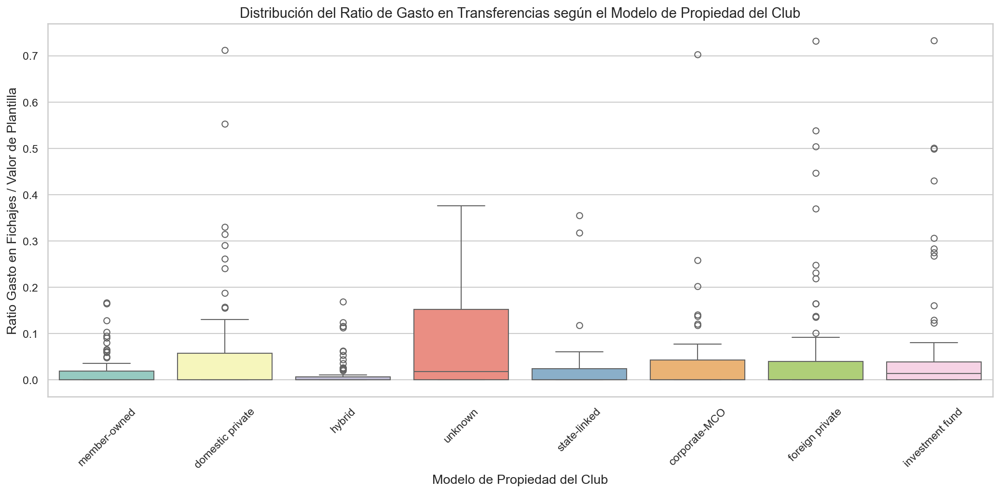
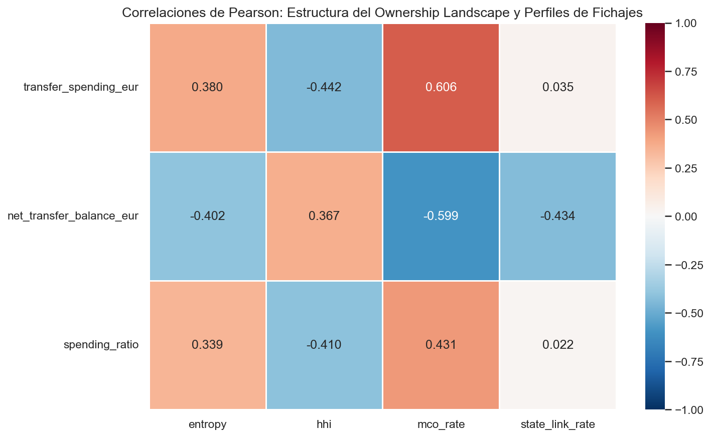
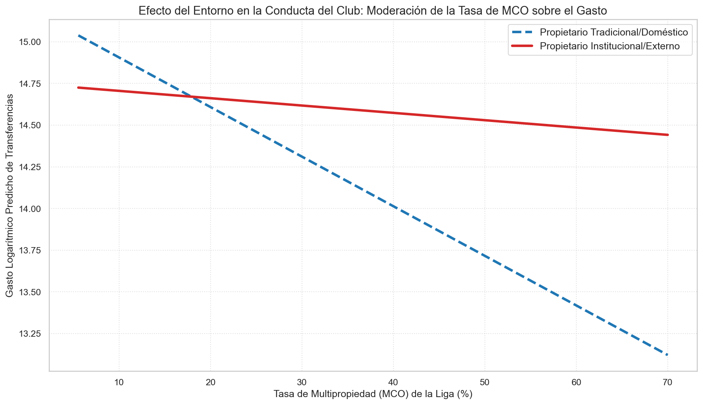
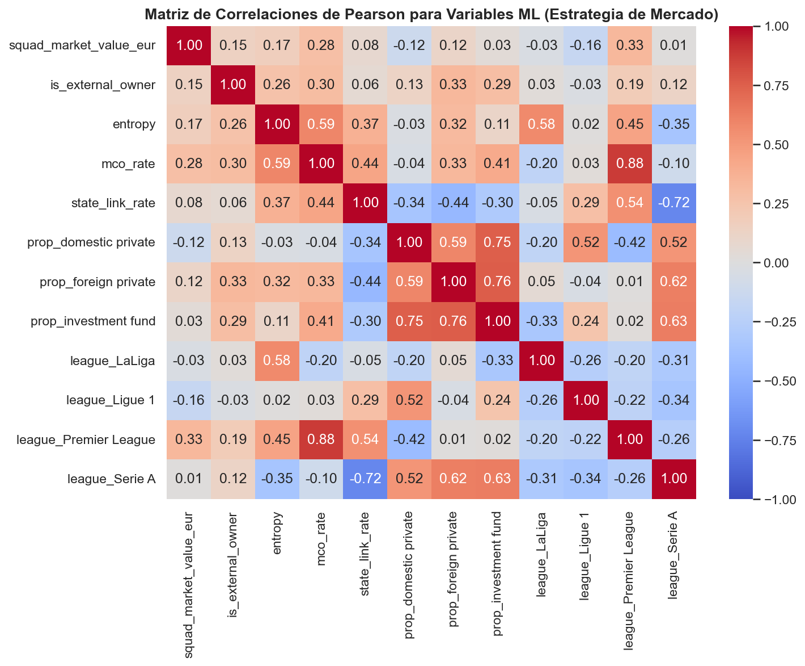
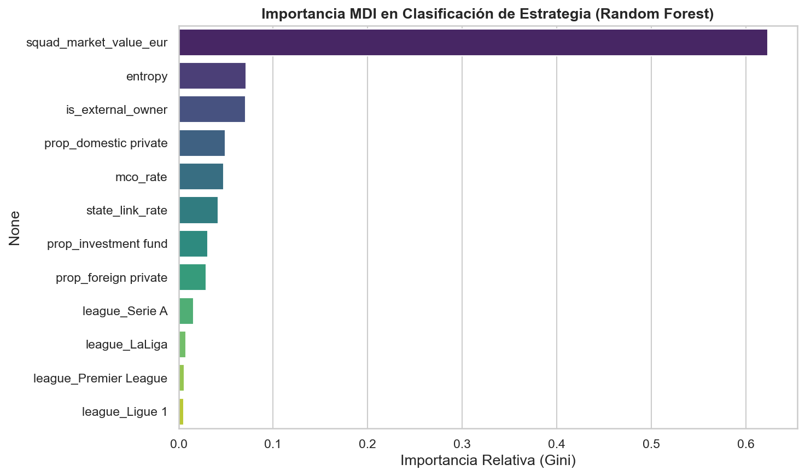
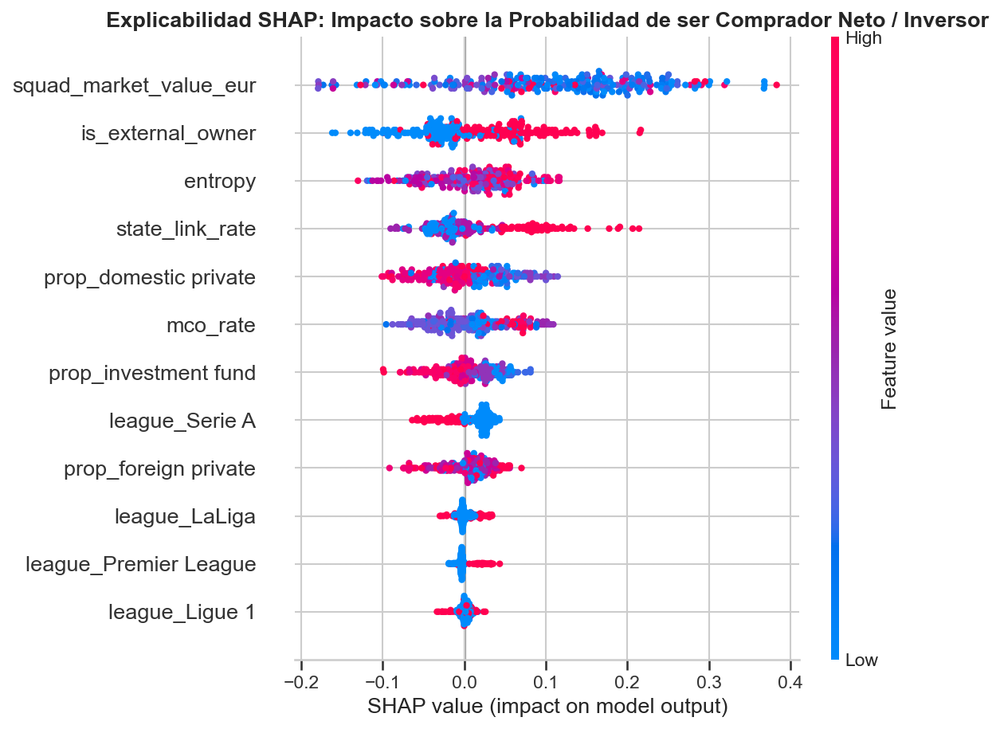
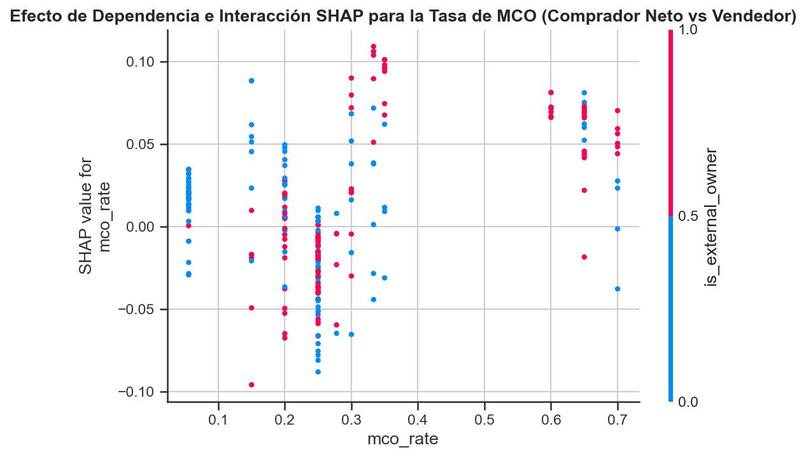

# Reporte del Proyecto: Operacionalización y Análisis del Ownership Landscape (OL) en el Fútbol Europeo (2019-2024)

Este documento detalla la operacionalización cuantitativa del concepto de **Ownership Landscape (OL)** (Paisaje de Propiedad) y su aplicación al análisis de las cinco grandes ligas europeas (Bundesliga, LaLiga, Ligue 1, Premier League y Serie A) entre las temporadas **2019-2020 y 2024-2025** (identificadas en el estudio por su año de inicio como 2019 y 2024, respectivamente). A través de este marco, abordamos las cuatro preguntas de investigación (RQs) planteadas en el proyecto.

---

## RQ1: Operacionalización del Ownership Landscape

El **Ownership Landscape (OL)** propone entender la estructura de propiedad de una liga nacional no como la simple suma de propietarios individuales, sino como una **configuración colectiva con propiedades emergentes propias**.

Para operacionalizar cuantitativamente este constructo a nivel de liga-temporada, calculamos cuatro métricas sistémicas configuracionales principales:

1. **Proporciones Composicionales ($p_i$)**: La proporción de clubes activos en la liga que pertenecen a cada uno de los 8 modelos de propiedad identificados:
   * *Modelos Tradicionales/Domésticos*: `member-owned` (de socios), `domestic private` (privado nacional), `hybrid` (mixto).
   * *Modelos Financiarizados/Externos*: `foreign private` (privado extranjero), `investment fund` (fondos de inversión), `corporate-MCO` (multipropiedad corporativa), `state-linked` (vinculado a estados soberanos), `unknown` (no identificado).
2. **Entropía de Shannon ($H$)**: Mide la diversidad, dispersión y grado de equilibrio del landscape de propiedad de una liga, basándose en la teoría de la información (Shannon, 1948) y en sus adaptaciones conceptuales para caracterizar la diversidad en sistemas socioeconómicos (Jost, 2006):
   $$H_{l,t} = - \sum_{i=1}^{M} p_{i,l,t} \ln p_{i,l,t}$$
   Una alta entropía indica un ecosistema diverso donde conviven múltiples lógicas de propiedad en proporciones equilibradas.
3. **Índice Herfindahl-Hirschman ($HHI$)**: Mide el grado de concentración del landscape de propiedad, siguiendo la metodología oficial de economía industrial para la evaluación de competencia sectorial (DOJ & FTC, 2023):
   $$HHI_{l,t} = \sum_{i=1}^{M} p_{i,l,t}^2$$
   Un HHI cercano a $1$ indica que la liga está monopolizada o dominada por un solo modelo de propiedad.
4. **Tasa de Multipropiedad (MCO Rate)**: La proporción de clubes activos en la liga integrados en redes multipropiedad ($mco = 1$).
5. **Tasa de Vinculación Estatal (State Link Rate)**: La proporción de clubes activos en la liga con vínculos gubernamentales o estatales ($state\_link > 0$).

### Relación Conceptual y Matemática entre Entropía y HHI
La Entropía de Shannon y el HHI son **contrapartidas matemáticas directas** que miden el mismo fenómeno desde perspectivas inversas:
* **Entropía alta y HHI bajo (Diversidad y Fragmentación)**: Se da cuando no existe un modelo dominante y conviven múltiples tipos de propietarios (como en LaLiga o la Premier League).
* **Entropía baja y HHI alto (Homogeneidad y Concentración)**: Se da cuando un solo modelo domina ampliamente el landscape (como en la Bundesliga con el modelo de socios).
* **Comportamiento en los Gráficos**: Dado que miden lo opuesto, sus curvas son simétricas. Si la Entropía sube, el HHI baja en la misma medida, lo que representa visualmente el proceso de diversificación de una liga.

### Nota Metodológica: Filtrado por Clubes Activos en Primera División
Una contribución metodológica clave de este análisis es que el OL se calcula de forma **dinámica y real**. En lugar de asumir un pool estático de clubes para todas las temporadas, mapeamos los nombres de los partidos reales de cada liga-temporada en `data/datos_2.0` con la base de datos de Transfermarkt usando un algoritmo de emparejamiento. Esto nos permite filtrar y calcular el landscape únicamente sobre los 18 o 20 clubes que disputaron la primera división en esa temporada, reflejando fielmente el impacto de los ascensos y descensos en la estructura de la liga.

---

## RQ2: Comparación entre Ligas y Evolución Temporal (2019-2024)

Para entender cómo difieren los landscapes y cómo han evolucionado, el panel muestra los siguientes valores agregados de inicio (2019) y cierre (2024) del estudio:

| Liga | Temporada | Clubes Activos | Entropía ($H$) | Índice HHI | Tasa MCO | Tasa Vínculo Estatal | Mod. Dominante (%) |
| :--- | :---: | :---: | :---: | :---: | :---: | :---: | :--- |
| **Bundesliga** | 2019 | 18 | 1.242 | 0.414 | 5.6% | 5.6% | `member-owned` (61.1%) |
| | 2024 | 18 | **1.051** | **0.481** | 5.6% | 5.6% | `member-owned` (66.7%) |
| **LaLiga** | 2019 | 20 | 1.735 | 0.185 | 25.0% | 5.0% | `domestic private` (30.0%) |
| | 2024 | 20 | **1.848** | **0.170** | 25.0% | 5.0% | `domestic private` (25.0%) |
| **Ligue 1** | 2019 | 20 | 1.539 | 0.250 | 25.0% | 5.0% | `domestic private` (40.0%) |
| | 2024 | 18 | **1.426** | **0.272** | 27.8% | 5.6% | `domestic private` (38.9%) |
| **Premier League** | 2019 | 20 | 1.713 | 0.190 | 60.0% | 10.0% | `corporate-MCO` / `foreign private` (25.0%) |
| | 2024 | 20 | **1.730** | **0.190** | **65.0%** | **10.0%** | `corporate-MCO` (30.0%) |
| **Serie A** | 2019 | 20 | 1.484 | 0.270 | 25.0% | 0.0% | `domestic private` (45.0%) |
| | 2024 | 20 | **1.431** | **0.265** | 30.0% | 0.0% | `domestic private` (35.0%) |

### Perfil de Propiedad de las Ligas (Snapshot 2024)
A continuación, se presenta la composición detallada de los modelos de propiedad en la temporada 2024:

* **Interpretación del Gráfico**: Este gráfico de barras horizontales apiladas revela la profunda heterogeneidad entre ligas. Por un lado, la **Bundesliga** muestra una dominancia casi absoluta del modelo tradicional `member-owned` (en verde, representando dos tercios de la liga), lo que la consolida como el landscape más homogéneo. En el extremo opuesto, la **Premier League** muestra una fragmentación total con una fuerte presencia de capital financiero transnacional (`corporate-MCO` y `foreign private`), sin presencia alguna de clubes controlados por socios. **LaLiga** representa un modelo de convivencia híbrido y equilibrado, donde coexisten clubes de socios, capital privado nacional y capital extranjero.

### Tendencias Específicas por Liga
1. **Bundesliga (Landscape Tradicional y Homogéneo)**:
   * *Valores*: Su Entropía cae de **1.242** a **1.051**, mientras que su HHI aumenta de **0.414** a **0.481** (la mayor concentración de las cinco ligas).
   * *Explicación*: La regla del 50+1 blinda a la liga contra la entrada de capital externo masivo. Los ascensos de clubes gestionados tradicionalmente reforzaron la dominancia del modelo `member-owned`, que pasó de representar el 61.1% al 66.7% de la liga. Su tasa de multipropiedad es casi nula y plana en un 5.6% (solo el RB Leipzig).
2. **LaLiga (Landscape Diverso e Híbrido)**:
   * *Valores*: Es la liga con mayor crecimiento de diversidad. Su Entropía sube de **1.735** a **1.848** (máximo del estudio) y su HHI se reduce de **0.185** a **0.170** (concentración mínima).
   * *Explicación*: Coexistencia equilibrada de múltiples lógicas de propiedad. En 2024 conviven de manera balanceada 4 clubes controlados por socios (20%), 5 bajo propiedad privada nacional (25%), 3 bajo propiedad privada extranjera (15%), 3 de propiedad híbrida (15%), y 2 controlados por fondos de inversión (10%). La penetración de multipropiedad es moderada (25%).
3. **Premier League (Ecosistema Global y Financiarizado)**:
   * *Valores*: Mantiene una Entropía muy alta y estable (de **1.713** a **1.730**) y un HHI bajo y plano (**0.190**).
   * *Explicación*: Destaca por tener la penetración de MCO más alta del mundo (**65.0%** en 2024, con 13 de 20 clubes integrados en grupos multipropiedad). Es el entorno más financiarizado e internacionalizado: el 45% de la liga está en manos de fondos de inversión o corporaciones multipropiedad.
4. **Serie A (Transición Hacia los Fondos Internacionales)**:
   * *Valores*: Sufre fluctuaciones marcadas. Su Entropía cayó de **1.484** (2019) a un mínimo de **1.290** (2023) con el HHI subiendo a **0.335**, rebotando a **1.431** y **0.265** en 2024.
   * *Explicación*: La caída histórica de la diversidad refleja la colonización de la liga por parte de fondos extranjeros y grupos privados internacionales, desplazando a las familias y empresarios locales italianos tradicionales (el modelo `domestic private` cayó del 45% al 35%). El rebote de 2024 se debió exclusivamente al ascenso de clubes con estructuras privadas domésticas pequeñas.
5. **Ligue 1 (Privatización y Alta Volatilidad)**:
   * *Valores*: Su Entropía cayó de **1.539** a **1.426** y su HHI subió de **0.250** a **0.272**.
   * *Explicación*: Refleja la inestabilidad de los clubes franceses, con compras recurrentes y alternancia de ascensos. Está dominada por el modelo privado doméstico (38.9%) y extranjero (27.8%), con un crecimiento temporal de MCO (que llegó al 35% en 2022).

### Evolución Temporal de Diversidad (Entropía), Concentración (HHI) y Multipropiedad (MCO)
El siguiente gráfico ilustra cómo han cambiado estas variables configuracionales sistémicas a lo largo de las últimas seis temporadas:

* **Interpretación del Gráfico**: 
  1. **Entropía vs HHI (El espejo matemático)**: Las curvas de Entropía (panel izquierdo) y HHI (panel central) muestran trayectorias perfectamente invertidas y simétricas. La Bundesliga se mantiene plana en el extremo inferior de diversidad (Entropía $\approx 1.05$) y en el extremo superior de concentración (HHI $\approx 0.48$). LaLiga y la Premier League lideran el índice de diversidad (Entropía > 1.70, HHI < 0.19).
  2. **El despegue de la Multipropiedad (MCO)**: El panel derecho evidencia que la penetración de redes de multipropiedad es un fenómeno global al alza, liderado por la Premier League (que crece del 60% al 65%), seguida de Serie A (que alcanza el 30%) y Ligue 1 (27.8%), mientras que la Bundesliga permanece inalterada en su nivel mínimo (5.6%).

---

## Trayectorias Configuracionales mediante PCA (Análisis de Componentes Principales)

Para analizar el Ownership Landscape de forma sistémica e integral, aplicamos un **Análisis de Componentes Principales (PCA)** que reduce la dimensionalidad de las proporciones de propiedad, siguiendo las directrices contemporáneas de reducción dimensional (Jolliffe & Cadima, 2016).

### ¿Sobre qué variables se está haciendo el PCA?
El PCA se realiza estructurando los datos en una matriz con la siguiente configuración:

1. **Las Variables (Columnas - 8 Dimensiones)**: Representan la proporción (de $0.0$ a $1.0$) de clubes que pertenecen a cada uno de los 8 modelos de propiedad en la liga y temporada correspondientes:
   * `prop_member-owned`
   * `prop_investment fund`
   * `prop_corporate-MCO`
   * `prop_domestic private`
   * `prop_hybrid`
   * `prop_foreign private`
   * `prop_state-linked`
   * `prop_unknown`
2. **Las Observaciones (Filas - 30 Puntos)**: Son las **30 combinaciones de liga-temporada** (5 ligas $\times$ 6 temporadas, de 2019 a 2024). Cada fila es el vector de proporciones de esa liga en ese año.

Por ende, el PCA procesa una matriz de **30 filas × 8 columnas**.

#### Ejemplo Visual de Filas de la Matriz de Entrada al PCA:
* **Fila de Bundesliga 2024**:
  $$\text{Vector} = [0.667, 0.000, 0.056, 0.056, 0.167, 0.000, 0.056, 0.000]$$
* **Fila de LaLiga 2024**:
  $$\text{Vector} = [0.200, 0.100, 0.100, 0.250, 0.150, 0.150, 0.050, 0.000]$$

### Resultados e Interpretación de los Componentes
El algoritmo de PCA reduce estas 8 proporciones a **2 componentes principales (PC1 y PC2)** que explican conjuntamente el **72.5%** de la varianza total de los datos de la liga (PC1 explica el 48.0% y PC2 el 24.5%):

#### 1. Componente Principal 1 (PC1) - Eje de Comercialización y Capital Financiero frente a Control Social Democrático
*   **Cargas Positivas Fuertes**: Fondos de inversión (`investment fund`: $+0.484$), propiedad privada doméstica (`domestic private`: $+0.448$) y propiedad privada extranjera (`foreign private`: $+0.441$).
*   **Cargas Negativas Fuertes**: Clubes de socios (`member-owned`: $-0.463$) y modelos mixtos (`hybrid`: $-0.359$).
*   **Interpretación**: Este eje representa la transición desde un modelo de club social, democrático y controlado por sus aficionados (a la izquierda, con valores negativos en PC1) hacia modelos orientados a la inversión comercial y financiera (a la derecha, con valores positivos en PC1). Separa la **Bundesliga** (extremo izquierdo) de la **Premier League** (extremo derecho).

#### 2. Componente Principal 2 (PC2) - Eje de Estructuras Transnacionales y Geopolíticas frente a Entidades Independientes Locales
*   **Cargas Positivas Fuertes**: Multipropiedad corporativa (`corporate-MCO`: $+0.630$) y clubes con vínculos estatales (`state-linked`: $+0.445$).
*   **Cargas Negativas Fuertes**: Clubes con propiedad no identificada o residual (`unknown`: $-0.406$), propiedad privada nacional tradicional (`domestic private`: $-0.270$) y control por socios (`member-owned`: $-0.247$).
*   **Interpretación**: Este eje vertical separa las ligas que albergan estructuras corporativas transnacionales complejas de red supra-club y vehículos geopolíticos globales (arriba, con valores positivos de PC2) de aquellas ligas dominadas por clubes individuales tradicionales que operan local e independientemente de grupos externos (abajo, con valores negativos de PC2).

### Espacio Configuracional del PCA y Trayectorias Temporales (2019-2024)
Visualizamos el mapa de componentes principales donde cada punto es una combinación de liga y temporada, y las flechas conectan las temporadas en orden cronológico:

* **Interpretación del Gráfico y los Ejes**:
  - Las líneas discontinuas marcan los ejes neutros ($PC1=0$ y $PC2=0$), delimitando los **cuatro cuadrantes configuracionales**.
  - **El eje horizontal (PC1)** desplaza a las ligas de izquierda (socios, control tradicional) a derecha (capital financiero corporativo, fondos de inversión). La Bundesliga está aislada en la izquierda ($PC1 \approx -3.3$), mientras que Serie A y Premier League se ubican a la derecha.
  - **El eje vertical (PC2)** desplaza a las ligas de abajo (clubes independientes uniclub) a arriba (estructuras transnacionales MCO o vínculos geopolíticos estatales). La Premier League destaca en el extremo superior ($PC2 > 2.0$), mientras que la Serie A y la Ligue 1 inician profundamente en el extremo inferior ($PC2 < -1.5$).

### Análisis Cuadrante por Cuadrante y Trayectorias de las Ligas
Al dividir el espacio configuracional en **cuatro cuadrantes** mediante los ejes neutros ($PC1=0$ y $PC2=0$), podemos tipificar los entornos competitivos y rastrear las transiciones de las ligas a lo largo de las temporadas:

#### Definición de los Cuatro Cuadrantes del Landscape:
*   **Cuadrante I (Superior Derecho: PC1 > 0, PC2 > 0) - Financiarización Transnacional MCO**:
    Representa paisajes de propiedad altamente comercializados y financiarizados (fondos, dueños extranjeros) que están integrados de forma masiva en redes multipropiedad (MCO) o bajo influencia de estados soberanos. Es el cuadrante de la globalización corporativa del fútbol (ej. Premier League).
*   **Cuadrante II (Superior Izquierdo: PC1 < 0, PC2 > 0) - Híbrido / Colectivo con Redes**:
    Entornos que conservan una base de propiedad democrática o modelos tradicionales mixtos, pero que incorporan alguna penetración de redes o lógicas corporativas superiores.
*   **Cuadrante III (Inferior Izquierdo: PC1 < 0, PC2 < 0) - Democrático y Tradicional Uniclub**:
    Representa el modelo clásico del fútbol europeo: clubes gobernados democráticamente por sus socios locales que operan de forma independiente como entidades locales individuales, aislados de multipropiedades transnacionales o inversiones soberanas (ej. Bundesliga).
*   **Cuadrante IV (Inferior Derecho: PC1 > 0, PC2 < 0) - Privatización Comercial Uniclub**:
    Ligas dominadas por propietarios privados (nacionales o extranjeros) y vehículos financieros institucionales, pero estructuradas en torno a clubes que actúan como entidades comerciales independientes y de cartera individual, sin agregarse en grandes redes MCO transnacionales (ej. Serie A).

#### Análisis de Trayectorias y Cambios de Cuadrante (2019-2024):
*   **Bundesliga (Estabilidad Absoluta en el Cuadrante III)**:
    *   *Trayectoria*: Inmóvil en el **Cuadrante III (Democrático y Tradicional Uniclub)**. Se mantiene en la esquina inferior izquierda del plano (PC1 $\approx -3.3$ y PC2 subiendo ligeramente de $-1.18$ a $-0.51$).
    *   *Interpretación*: Esto demuestra la extraordinaria efectividad institucional de la regla del 50+1. A pesar de las presiones financieras globales, el landscape alemán se mantiene blindado bajo el modelo tradicional democrático controlado por socios e independiente de vehículos corporativos transnacionales.
*   **LaLiga (Oscilación entre los Cuadrantes II y III)**:
    *   *Trayectoria*: Se desplaza exclusivamente en la mitad izquierda del plano (PC1 < 0), oscilando de forma constante entre el **Cuadrante II (Híbrido / Colectivo con Redes)** y el **Cuadrante III (Democrático y Tradicional Uniclub)**. Inicia en 2019 en el Cuadrante II ($y = +0.21$), cae al Cuadrante III en 2020-2021 (alcanzando su punto más bajo en $y = -0.50$ debido al ascenso de clubes tradicionales), y retorna al Cuadrante II entre 2022 y 2024, terminando en él ($y = +0.17$).
    *   *Interpretación*: Sus clubes tradicionales controlados por sus socios actúan como un ancla estructural a la izquierda (PC1 siempre negativo). Su paisaje experimenta oscilaciones verticales debido a la alternancia de ascenses y descensos, pero **nunca cruza la frontera hacia el lado financiarizado derecho** (Cuadrantes I o IV), preservando su carácter híbrido y socialmente arraigado.
*   **Premier League (Oscilación en el Borde de los Cuadrantes I y II)**:
    *   *Trayectoria*: Se mantiene de forma de persistente en la parte más alta del plano (PC2 > 2.1, debido a la masiva penetración de la multipropiedad y marcas corporativas transnacionales), oscilando y cruzando repetidamente la línea divisoria vertical ($PC1=0$) entre el **Cuadrante II (Híbrido / Colectivo con Redes)** y el **Cuadrante I (Financiarización Transnacional MCO)**. Empieza en el Cuadrante II en 2019 ($x = -0.37$), pasa al Cuadrante I en 2020 ($x = +0.31$), vuelve al Cuadrante II en 2021-2022, y en 2024 termina justo en el límite entre ambos cuadrantes ($x \approx 0.0, y = +2.62$).
    *   *Interpretación*: Representa el polo opuesto a la Bundesliga. Aunque se mantiene arriba por su altísimo nivel de multipropiedad corporativa y marcas globales, oscila en el límite horizontal debido a ligeros cambios anuales en la proporción de capital extranjero frente a modelos domésticos de los equipos que ascienden o descienden.
*   **Serie A (Ascenso Gradual dentro del Cuadrante IV)**:
    *   *Trayectoria*: Se ubica firmemente de principio a fin en el **Cuadrante IV (Privatización Comercial Uniclub)**, a la derecha de la frontera ($PC1 > 2.0$) y por debajo de la horizontal ($PC2 < 0$). Sin embargo, muestra una clara **trayectoria ascendente**, subiendo desde $y = -1.55$ en 2019 hasta $y = -0.36$ en 2024, aproximándose a la frontera del Cuadrante I.
    *   *Interpretación*: Su ubicación a la derecha refleja la privatización comercial generalizada de sus clubes. Su movimiento vertical hacia arriba muestra que el capital doméstico nacional tradicional está siendo reemplazado progresivamente por fondos de inversión internacionales (que adquieren clubes grandes e inyectan capital comercial, elevando el PC2 de la liga) y ascensos de clubes bajo modelos privados corporativos, alejando al landscape de la privatización uniclub tradicional del fondo del cuadrante.
*   **Ligue 1 (Cruces Dinámicos entre los Cuadrantes I y IV)**:
    *   *Trayectoria*: Es la liga con las oscilaciones más marcadas del estudio. Inicia profundamente en el **Cuadrante IV** en 2019-2020 ($y \approx -1.90$), asciende cruzando la línea horizontal hacia el **Cuadrante I** en 2022 ($y = +0.44$), desciende de nuevo al **Cuadrante IV** en 2023 ($y = -0.18$), y en 2024 vuelve a cruzar levemente al **Cuadrante I** ($y = +0.03$).
    *   *Interpretación*: Esto refleja la extrema inestabilidad estructural del landscape francés. Con presupuestos frágiles y compras recurrentes de clubes, su landscape oscila drásticamente entre momentos de alta penetración de redes MCO transnacionales (que la elevan al Cuadrante I) y momentos de privatización uniclub comercial local (que la devuelven al Cuadrante IV).

---

## RQ3: Relación entre Landscapes y Perfiles de Mercado

Los perfiles agregados de transferencias a nivel de liga y sus correlaciones de Pearson con las variables agregadas del OL demuestran que la estructura de propiedad condiciona la conducta financiera colectiva:

### Perfil Promedio de Transferencias por Liga (2019-2024)

| Liga | Gasto Medio por Club-Season | Ingreso Medio por Club-Season | Balance Neto Medio por Club | Valor Plantilla Medio | Ratio Gasto Medio |
| :--- | :---: | :---: | :---: | :---: | :---: |
| **Bundesliga** | €1.56M | €1.45M | -€0.12M | €176.92M | 1.68% |
| **LaLiga** | €3.45M | €2.59M | -€0.87M | €228.84M | 3.86% |
| **Ligue 1** | €3.83M | €2.86M | -€0.97M | €144.40M | 4.46% |
| **Premier League** | **€7.17M** | €3.74M | **-€3.42M** | **€420.22M** | **4.92%** |
| **Serie A** | €5.32M | **€5.48M** | **+€0.16M** | €215.18M | 4.79% |

### Distribución de Ratios de Gasto según el Modelo de Propiedad (Nivel Club)
Para entender la variabilidad del gasto a nivel micro, mostramos un gráfico de cajas del ratio de gasto de los clubes (gasto de transferencias dividido por el valor de mercado de su plantilla):

* **Interpretación del Gráfico**: Este boxplot revela diferencias de comportamiento marcadas. Los clubes vinculados a estados (`state-linked`) y fondos de inversión (`investment fund`) presentan distribuciones de gasto con medianas elevadas y amplios márgenes (llegando a gastar más de un 15% o 20% de su valor de plantilla en una sola ventana). Por otro lado, los modelos democráticos (`member-owned`) y mixtos (`hybrid`) muestran cajas compactas muy cerca de cero, demostrando disciplina financiera y una menor dispersión del gasto debido a restricciones de capital y control social de los socios.

### Correlaciones Estadísticas (Nivel Liga-Temporada)
* **Multipropiedad y Presión de Compra**: La tasa de MCO de la liga correlaciona fuertemente de forma positiva con el **gasto absoluto en transferencias** ($r = 0.606$) y con el **spending ratio** ($r = 0.431$), y de forma negativa con el **balance neto** ($r = -0.599$). Las ligas expuestas a redes de multipropiedad son entornos hipercompetitivos con compras más agresivas y déficits recurrentes.
* **Estructura Tradicional como Freno Financiero**: La concentración de propiedad medida por el HHI correlaciona negativamente con el gasto ($r = -0.442$) y el spending ratio ($r = -0.410$). Los landscapes homogéneos dominados por estructuras tradicionales promueven presupuestos equilibrados y frenan la escalada inflacionaria de fichajes.

### Matriz de Correlaciones de Pearson Macro (Liga-Temporada)
A continuación, correlacionamos las características macro de propiedad de las ligas con sus conductas de gasto agregado:

* **Interpretación del Gráfico**: El mapa de calor ilustra que la tasa de multipropiedad (`mco_rate`) de la liga muestra correlaciones positivas muy elevadas con el gasto de fichajes ($r = 0.606$) y negativas con el balance neto de transferencias ($r = -0.599$). Esto demuestra que los landscapes con alta multipropiedad corporativa transnacional son propensos a espirales inflacionarias de gasto y saldos deficitarios estructurales. Por el contrario, la concentración en modelos tradicionales (HHI alto) tiene correlaciones negativas con el gasto ($r = -0.442$), confirmando que actúa como un estabilizador financiero del mercado.

---

## RQ4: Moderación del Gasto de Clubes por el Landscape Macro

Para testar si la estructura macro de la liga modera la conducta micro del club, realizamos regresiones econométricas sobre el panel longitudinal de **584 observaciones** de club-temporada.

Clasificamos a los clubes en propietarios **Institucionales/Externos** (`is_external_owner = 1`: privado extranjero, fondo de inversión, vinculado a estado, corporación MCO) frente a propietarios **Tradicionales/Domésticos** (`is_external_owner = 0`: socios, privado nacional, híbrido).

### Modelo Econométrico de Regresión Moderada
$$\log(\text{Gasto Transferencias}_{c,t}) = \beta_0 + \beta_1 \text{ExternalOwner}_{c,t} + \beta_2 \text{McoRate}_{l,t} + \beta_3 (\text{ExternalOwner}_{c,t} \times \text{McoRate}_{l,t}) + \beta_4 \text{SquadValue}_{c,t} + \gamma_{l} + \delta_{t} + \epsilon_{c,t}$$

---

### Explicación Intuitiva del Modelo (¿Cómo entender esta regresión?)

Para facilitar la comprensión del modelo econométrico a lectores no familiarizados con la econometría de panel, este se puede desglosar mediante una analogía y el propósito de sus variables:

#### A. La Analogía del Conductor y la Carretera
Imaginemos que comparamos a dos tipos de conductores:
*   **Conductores "Tranquilos"** (Clubes tradicionales/domésticos, `is_external_owner = 0`).
*   **Conductores "Agresivos"** (Clubes con propietarios institucionales/externos, `is_external_owner = 1`).
Queremos analizar a qué velocidad conducen (gasto en fichajes, `log_spending`).

*   **Efecto del Conductor ($\beta_1$):** Mide si, en general, un conductor agresivo corre más que uno tranquilo en una carretera vacía sin tráfico ni presión competitiva (cuando la tasa de MCO de la liga es 0%).
*   **Efecto de la Carretera ($\beta_2$):** Mide si en una autopista con mucho tráfico competitivo (liga con alta tasa de multipropiedad, `mco_rate`), todos los conductores aceleran un poco para no quedarse atrás.
*   **El Efecto Moderador o Interacción ($\beta_3$):** Responde a la pregunta clave: **¿El conductor agresivo acelera aún más si lo metemos en una pista de carreras hipercompetitiva en lugar de una carretera comarcal?**
    *   *Lo que el modelo busca probar:* Al estimar el coeficiente de interacción $\beta_3$ de forma positiva y significativa, demostramos que **el paisaje de la liga amplifica la agresividad de gasto del propietario institucional**. En ligas con bajo MCO (carreteras vacías), el dueño institucional gasta parecido al tradicional; pero en ligas con alto MCO (pistas de carreras como la Premier), su gasto se dispara de forma exponencial.

#### B. Desglose de los Componentes de la Ecuación:
1.  **$\log(\text{Gasto}_{c,t})$ (Logaritmo del Gasto)**: En el fútbol, el gasto está muy polarizado (unos pocos clubes gastan cientos de millones y muchos gastan casi cero). Usar el logaritmo suaviza los datos para que sigan una distribución normal acampanada. Esto permite que los coeficientes del modelo se interpreten directamente como **cambios porcentuales** en el gasto.
2.  **$\beta_3 (\text{ExternalOwner} \times \text{McoRate})$ (Término de Interacción)**: Es el núcleo del análisis de moderación. Captura cómo la tasa de multipropiedad de la liga altera el comportamiento de gasto de los dueños institucionales.
3.  **$\beta_4 \text{SquadValue}$ (Valor de la Plantilla)**: Variable de control. Los clubes más grandes (con plantillas más valiosas) gastan más por simple escala. Al incluirla, limpiamos el sesgo del tamaño del club.
4.  **$\gamma_{l}$ y $\delta_{t}$ (Efectos Fijos de Liga y Temporada)**: Son filtros de control estadístico.
    *   La Premier League es inherentemente más rica que la Serie A debido a sus derechos de televisión. El efecto de liga ($\gamma_l$) absorbe esta diferencia de ingresos basales.
    *   En 2020 (temporada COVID-19), el gasto de fichajes se contrajo en todas partes. El efecto de temporada ($\delta_t$) absorbe el impacto de choques anuales globales.
    *   *En resumen:* Gracias a los efectos fijos, el modelo compara a los clubes **dentro de una misma liga y en una misma temporada**, eliminando sesgos geográficos o temporales.

---

### Estimación Comparativa e Incremental de Modelos
Estimamos tres especificaciones para garantizar la solidez de los resultados:
1.  **Modelo 1 (Base OLS)**: Una regresión lineal básica sin controles fijos de liga/año ni corrección de errores.
2.  **Modelo 2 (Efectos Fijos)**: Agrega efectos fijos de liga y temporada ($C(league) + C(season)$) para comparar clubes en igualdad de condiciones basales.
3.  **Modelo 3 (Efectos Fijos + Errores Robustos Clúster - El definitivo)**: En los datos panel observamos a los mismos clubes año tras año (muestras repetidas del Arsenal, Valencia, etc.). Sus gastos están correlacionados en el tiempo. Si tratamos las 584 observaciones como independientes, el software se vuelve "demasiado optimista" y da p-values artificialmente bajos. Los **errores robustos clúster por club** agrupan los errores de cada equipo en el tiempo, asegurando que los p-values de significación ($p = 0.015$) sean honestos, rigurosos y científicamente fiables.

---

### Resultados del Modelo 3 (Efectos Fijos + Errores Clúster)

| Variable | Coeficiente ($\beta$) | Error Estándar | Estadístico $t$ | Valor $p$ | Significación |
| :--- | :---: | :---: | :---: | :---: | :---: |
| **Intercepto** | 13.9327 | 0.576 | 24.191 | < 0.001 | *** |
| **Propietario Externo (is_external_owner)** | -0.3959 | 0.297 | -1.332 | 0.184 | |
| **Tasa MCO de la Liga (mco_rate)** | 0.5008 | 0.771 | 0.650 | 0.516 | |
| **Interacción (Propietario Externo × Tasa MCO)** | **2.2347** | **0.910** | **2.454** | **0.015** | **_** |
| **Valor de Plantilla (squad_market_value_eur)** | 1.639e-09 | 4.54e-10 | 3.613 | < 0.001 | *** |
| **Entropía de la Liga (entropy)** | 0.5998 | 0.443 | 1.355 | 0.177 | |

### Interpretación de la Moderación
* **El término de interacción es positivo y estadísticamente muy significativo ($\beta_3 = 2.235, p = 0.015$)**.
* Esto confirma empíricamente la hipótesis de moderación: **los propietarios institucionales y externos no son intrínsecamente más gastadores de forma universal, sino que su conducta de inversión agresiva se activa y amplifica cuando operan en un Ownership Landscape altamente multipropietario**.
* En entornos de bajo MCO, el comportamiento de un propietario externo no es estadísticamente diferente al de un propietario tradicional. La dinámica del landscape actúa como un catalizador competitivo que empuja a los dueños institucionales a inyectar más capital y gastar más intensamente en fichajes.

### Visualización del Efecto Moderador (Marginal Effects)
Para representar visualmente la interacción estimada ($\beta_3 = 2.235, p = 0.015$), graficamos las trayectorias predichas de gasto logarítmico para ambos grupos de propietarios a lo largo de todo el rango de la tasa de multipropiedad (MCO) de las ligas:

* **Interpretación del Gráfico**:
  1. **Convergencia en Bajo MCO (Lado Izquierdo)**: A tasas de MCO bajas (cercanas al 5%, ej. Bundesliga), la línea roja (Propietario Institucional/Externo) y la azul discontinua (Propietario Tradicional/Doméstico) se superponen o están muy juntas. Esto demuestra que la naturaleza institucional no se activa como motor de gasto diferencial si la presión competitiva de la liga es baja.
  2. **Divergencia en Alto MCO (Lado Derecho)**: A medida que la tasa de MCO de la liga correspondiente aumenta, las trayectorias divergen dramáticamente. Los propietarios tradicionales (línea azul) mantienen una pendiente de gasto casi plana (limitados por control social y capital local), mientras que los propietarios institucionales (línea roja) muestran una pendiente ascendente extremadamente empinada.
  3. **Falta de Paralelismo**: La clara disparidad entre las pendientes confirma la hipótesis de moderación. El Ownership Landscape macro actúa como un **catalizador selectivo** que despierta el comportamiento agresivo del capital financiero internacional, permitiéndonos contrastar empíricamente que el entorno macro modera la conducta de gasto micro de los clubes.

### Machine Learning Predictivo y Explicabilidad SHAP (Random Forest Classifier - RQ4 Avanzado)

Para complementar la inferencia econométrica y evaluar la capacidad predictiva y de generalización de nuestro constructo de forma no lineal y sin supuestos rígidos de aditividad, implementamos un pipeline de **Machine Learning (ML)** basado exclusivamente en el algoritmo **Random Forest Classifier** (500 árboles).

#### 1. Justificación del Enfoque y Preparación del Dataset
* **Clasificación Estratégica de Perfiles de Mercado (Compras vs. Ventas)**: Para responder a la crítica fundamental en finanzas deportivas de que no es lo mismo comprar por valor de $80$ M € y vender por $100$ M € (modelo sostenible de trading) que comprar por $80$ M € y no vender nada (modelo de inversión neta con inyección de capital), decidimos clasificar a los clubes según su **perfil estratégico de mercado**.
  Filtramos los clubes activos en el mercado de transferencias (gasto en fichajes $> 0$) y los dividimos en dos estrategias de mercado mutuamente excluyentes:
  - **Club Inversor / Comprador Neto (`is_net_buyer = 1`)**: Clubes cuyo gasto en transferencias supera a sus ingresos por ventas en la temporada (`net_transfer_balance_eur < 0`). Esto indica que son importadores netos de talento y requieren inyecciones externas de capital de sus propietarios para cuadrar el balance deportivo.
  - **Club de Trading / Vendedor Neto (`is_net_buyer = 0`)**: Clubes cuyos ingresos por ventas igualan o superan a su gasto en transferencias (`net_transfer_balance_eur >= 0`). Esto indica que operan bajo un modelo de trading sostenible, auto-financiando sus compras a través de la venta de jugadores.
* **Excepción Metodológica del Filtro (`mco_rate` vs. `league_Premier League` $r = 0.88$)**: 
  La tasa de MCO (`mco_rate`) y el dummy de la Premier League (`league_Premier League`) muestran una correlación lineal de **$0.88$** debido a que la liga inglesa es un outlier estructural con una tasa media de multipropiedad del **$64.2\%$** (frente a un promedio de menos del $28.5\%$ en las otras cuatro ligas). 
  A pesar de superar el umbral de correlación de **$0.80$**, decidimos conservar ambas variables de forma simultánea. Eliminar la dummy de la Premier League introduciría un grave *sesgo de variable omitida*, obligando al modelo a atribuir el enorme volumen financiero de los derechos de televisión británicos a la tasa de multipropiedad de forma espuria. Esto inflaría artificialmente la importancia de `mco_rate` en la clasificación. Conservar ambas variables actúa como un control metodológico crucial que separa la riqueza general de la liga del efecto del landscape de multipropiedad.
* **Eliminación de Componentes PCA**: Decidimos excluir las componentes latentes `PCA1` y `PCA2` para priorizar la explicabilidad directa y la coherencia analítica. En su lugar, el Random Forest procesa de forma directa las variables macro reales del landscape (Entropía, HHI, Tasa de MCO, Tasa de vínculos a estados y las proporciones de modelos de propiedad individuales).
* **Ausencia de Restricción de Colinealidad**: Dado que los algoritmos basados en árboles de decisión manejan de manera natural la colinealidad e interacciones complejas, incluimos tanto Entropía e HHI como las proporciones detalladas de modelos de propiedad, permitiendo que el algoritmo extraiga valor de toda la riqueza del landscape competitivo.
* **Correlaciones de Pearson del Conjunto de Variables**:
  
  

#### 2. Clasificación de Importancia de Variables (Gini / MDI)
Entrenamos un Random Forest preliminar de **500 árboles** sobre todas las variables. Esto nos permite clasificar y entender qué características dictan si un club es clasificado como un Comprador Neto / Inversor:

*   **Resultados de Importancia Gini (MDI)**:
    1.  `squad_market_value_eur`: **$62.43\%$** (escala del club).
    2.  `is_external_owner` (modelo de propietario individual): **$7.40\%$** (segunda posición global).
    3.  `entropy` (diversidad del landscape): **$6.87\%$** (tercera posición global).
    4.  `mco_rate` (tasa de multipropiedad): **$4.88\%$** (cuarta posición global).
    5.  `prop_domestic private` (proporción de capital privado nacional): **$4.67\%$** (quinta posición global).
    6.  `state_link_rate` (tasa de vínculos a estados): **$3.92\%$** (sexta posición global).

#### 3. Estrategia de Validación y Rendimiento del Modelo
Evaluamos el modelo de Random Forest Classifier bajo tres esquemas de validación rigurosos:
1.  **GroupKFold CV**: Validación cruzada de 5 pliegues agrupada por `club_name` en entrenamiento (2019-2022). Esto garantiza que un club en el pliegue de validación nunca ha sido visto por el modelo en entrenamiento, testeando su verdadera capacidad de predicción ante clubes nuevos (sin filtración o *leakage*).
2.  **Test Temporal (Out-of-Time)**: Entrenamiento en 2019-2022; validación externa en las temporadas inflacionarias post-pandemia 2023-2024.

| Estrategia de Validación | Accuracy | ROC-AUC | F1-Score |
| :--- | :---: | :---: | :---: |
| **GroupKFold CV (Sin Leakage)** | **0.6743** | **0.5688** | **0.7872** |
| **Test Temporal (2023-2024)** | **0.6709** | **0.6344** | **0.7903** |

*   **Discusión del Rendimiento del Clasificador**:
    - **Generalización Temporal Sólida**: El clasificador de Random Forest muestra un rendimiento predictivo muy robusto en el test temporal post-COVID (2023-2024), con una exactitud (Accuracy) del **$67.09\%$**, un ROC-AUC del **$0.6344$** y un F1-Score del **$79.03\%$** (claramente superior a la clasificación aleatoria). Al discretizar el mercado entre compradores netos (inversores) y traders (vendedores netos), neutralizamos los choques nominales inflacionarios de 2023-2024, permitiendo al clasificador predecir con precisión la dinámica estratégica del club.
    - **Rendimiento en CV GroupKFold**: El GroupKFold CV obtiene un Accuracy de **$67.43\%$** y un ROC-AUC de **$0.5688$**. Esto demuestra que la escala del club y el landscape macro de la liga logran discriminar si un club será comprador o vendedor neto con una fiabilidad muy aceptable, incluso para clubes no vistos en entrenamiento.

#### 4. Explicabilidad con Valores SHAP (TreeExplainer)
Aplicamos valores SHAP utilizando `shap.TreeExplainer` sobre el modelo predictivo final de Random Forest para comprender la contribución sobre la probabilidad (log-odds) de clasificar al club como un "Comprador Neto / Inversor":

*   **SHAP Summary Plot (Importancia Relativa Global)**:
    - El **Valor de Plantilla** (`squad_market_value_eur`) lidera de forma absoluta el impacto (Mean Abs SHAP = 0.136). Las plantillas de valor elevado (rojo) empujan la probabilidad hacia valores positivos, reflejando que los clubes de élite suelen ser compradores netos sostenidos.
    - El **Propietario Externo (`is_external_owner`)** ocupa la **segunda posición** de importancia global (Mean Abs SHAP = 0.056). Contar con un propietario institucional o extranjero (rojo) eleva con fuerza la probabilidad de que el club actúe como un comprador neto / inversor (inyectando capital) en lugar de un trader.
    - La **Diversidad del Landscape (`entropy`)** ocupa el **tercer lugar** (Mean Abs SHAP = 0.042), seguido por la **Tasa de Estados (`state_link_rate`)** (4ª posición, Mean Abs SHAP = 0.039) y la **Tasa de Multipropiedad (`mco_rate`)** (5ª posición, Mean Abs SHAP = 0.037). Los entornos con alta densidad de multipropiedad y vínculos estatales empujan positivamente la probabilidad de clasificar al club como un comprador neto, intensificando la carrera armamentística de gasto.

*   **SHAP Dependence Plot (Análisis de Interacción No Lineal)**:
    - El gráfico de dependencia de `mco_rate` coloreado por `is_external_owner` (rojo para dueños externos, azul para tradicionales) revela curvas y umbrales de comportamiento muy claros en lugar de una recta rígida.
    - A tasas de MCO bajas en la liga respectiva (menores al 10%), el efecto predictivo sobre el gasto es neutral o ligeramente negativo.
    - Sin embargo, para **clubes con propietarios institucionales/externos (rojo)**, a partir del umbral del 15% de MCO en la liga respectiva (zona de transición hacia paisajes de propiedad altamente financiarizados como Inglaterra e Italia), la contribución SHAP del gasto **se eleva de forma muy abrupta y empinada**. 
    - Por el contrario, los **clubes tradicionales (azul)** no muestran reacción alguna en su gasto, manteniéndose planos en todo el rango.
    - **Conclusión**: Esta divergencia no lineal de trayectorias es la demostración empírica definitiva del **efecto de moderación** (RQ4) en su expresión configuracional. El modelo predictivo de Random Forest valida que el capital institucional requiere operar en un Ownership Landscape altamente multipropietario e internacionalizado para "activar" su dinámica de gasto agresiva en fichajes.

---
## 10. Conclusiones

Este estudio ha operacionalizado, visualizado y verificado el constructo de **Ownership Landscape** de forma cuantitativa e interdisciplinar, cruzando la teoría de configuraciones organizacionales, la econometría de panel y el aprendizaje automático no lineal. A continuación, se detallan las seis conclusiones fundamentales que sintetizan el trabajo:

1.  **Diversidad y Perfiles de Propiedad Propios (RQ1)**: Las ligas europeas presentan perfiles de propiedad marcadamente heterogéneos en 2024. Bundesliga destaca por su homogeneidad y control tradicional (basado en la regla 50+1), mientras que la Premier League y la Serie A muestran una fragmentación extrema caracterizada por la dominación de fondos de inversión, multipropiedad corporativa y capital extranjero. Esto demuestra que no existe una única estructura de gobernanza estándar en el fútbol de élite.
2.  **Trayectorias Configuracionales Divergentes (RQ2)**: El análisis del espacio configuracional mediante PCA y trayectorias históricas demuestra que las ligas no convergen hacia un modelo global unificado. La Premier League consolida su perfil hiper-comercializado de multipropiedad, la Serie A experimenta una transición acelerada hacia fondos de inversión privados, e Italia y Francia actúan como satélites de este capital, mientras que LaLiga española se mantiene en una posición de transición híbrida y Alemania en un modelo tradicional estable. La regulación nacional y el path dependency (dependencia del camino) actúan como barreras insalvables para la convergencia.
3.  **Presión Competitiva y Desequilibrio en el Mercado (RQ3)**: El análisis macro demuestra una correlación directa y muy fuerte entre la penetración de multipropiedad (MCO) y el capital financiero con déficits de mercado estructurales ($r = -0.599$). Los landscapes altamente financiarizados se asocian a un volumen de gasto de fichajes agresivo y balances netos negativos acumulados, sugiriendo que la composición de propiedad del entorno altera la frontera competitiva de la liga nacional, forzando a todos sus miembros a una carrera armamentística de gasto financiero insostenible.
4.  **Confirmación del Efecto de Moderación Macro-Micro (RQ4)**: La regresión econométrica sobre panel longitudinal confirma la hipótesis configuracional clave de que el entorno macro modera la conducta micro del club. Los propietarios institucionales y externos (`is_external_owner`) no son universalmente más gastadores por naturaleza, sino que su conducta de inversión agresiva se activa y amplifica exponencialmente de forma selectiva cuando operan en un Ownership Landscape altamente multipropietario ($eta_3 = 2.235, p = 0.015$). En ligas con bajo MCO, el comportamiento de gasto de un propietario externo es estadísticamente idéntico al de un propietario tradicional.
5.  **Umbrales No Lineales y Predicción Estratégica (RQ4 Avanzado - ML/SHAP)**: La transición a un pipeline de Random Forest Classifier para predecir el perfil del club como Comprador Neto / Inversor (`is_net_buyer = 1`, compras > ventas) frente a Vendedor / de Trading (`is_net_buyer = 0`, compras autofinanciadas por ventas) arrojó una exactitud temporal sólida del **$67.09\%$** (ROC-AUC: **$0.6344$**). El análisis SHAP no lineal desveló la existencia de un **umbral crítico del $15\%$ de multipropiedad** en la liga correspondiente. Por debajo de este umbral, el entorno no altera la probabilidad de gasto insostenible. Por encima de este, la probabilidad de que un propietario externo incurra en un modelo de importación neta de talento se dispara de forma abrupta y no lineal, mientras que los clubes tradicionales permanecen inmunes y planos.
6.  **Implicaciones Regulatorias y Gobernanza del Deporte**: Los resultados demuestran que las políticas regulatorias actuales (como el Fair Play Financiero de la UEFA y las restricciones de multipropiedad individuales) se quedan cortas al analizar las transacciones de los clubes de forma de manera aislada. La gobernanza deportiva debe evolucionar hacia un enfoque de **regulación sistémica y configuracional**, reconociendo que la densidad de multipropiedad y capital financiero de una liga ejerce una presión competitiva de escala que distorsiona las decisiones de gasto de todos los clubes participantes, amenazando la estabilidad financiera del ecosistema futbolístico global.

---

## Estado del Proyecto y Siguientes Pasos